·自动摘要技术·


#### 发展历史：

​	 20世纪50年代，自动摘要（和机器翻译）被提出：对给定文本提取包含最重要信息的描述-摘要。一个代表性研究由H. P. Luhn提出，用程序对机器可读形式的完整文本进行分析，用词频及其分布的统计信息来计算重要性度量的方式。
​	1969年，Harold P Edmundson 描述了一个**基于关键短语**的范例，除了标准频率依赖权重之外，还使用以下三种方法来确定句子权重：Cue Method，Title Method，Location Method。
​	1990年，LSA（隐语义分析）被Susan Dumais等人提出
​	2001年，LSA 被 Yihong Gong 和 Xin Liu 提出为新闻领域中的单/多文档摘要选择高排名的句子。

> **抽取式**摘要方法大多是启发式计算句子分数，没有概率角度的解释，于是开始转向**贝叶斯方法**

​	2003年，Andrew Y. Ng等人提出 LDA（隐狄利克雷分布)，结合了贝叶斯思想的概率隐性语义分析（pLSA）。
​	2015年，Ming Zhou等人在RNN上对多文档摘要进行句子排名，利用分层回归计算句子、短语在解析树中的显著性从而实现提取内容和过滤冗余，R2N2在DUC 2001,2002和2004多文档摘要数据集上是最先进的摘要生成方法。

> 基于**RNN**的自动摘要方法对短文本非常好，而对长文本生成的摘要会有冗余和不连贯问题

​	2017年，Richard Socher等人提出一种使用读取输入的 biLSTM编码器和生成输出的 LSTM解码器的神经网络结构：1）**内部注意力策略**（intra-attention strategy）分别关注输入和持续输出；2）将有监督词预测和 **强化学习** 结合起来。
​		
​	2017年，Christopher D. Manning等人，提出以两种正交方式增强标准的Seq2Seq注意力模型：1）使用混合指针生成器网络，从源文本中复制单词并保留生成器的新单词生成功能； 2）使用覆盖率来跟踪已总结内容以防止重复生成。

```
目前最先进方法：
	A Deep Reinforced Model for Abstractive Summarization
	Convolutional Sequence to Sequence Learning  - ConvS2S
```


#### 方法总结：

​	**基于统计**：关注词频和句子权重；
​	**基于图模型**：构建拓扑结构图对词句排序；
​	**基于隐语义**：使用主题模型挖掘语句潜在信息，如LDA、pLSA；
​	**基于线性规划**：转化为路径规划问题求全局最优解。

#### 常用模型：

​	Bag Of Words、Word2Vec、N-gram、TFIDF、LSI/pLSI、LDA

#### 代表系统：

TextTeaser 开源代码有三个class，其中Summarizer为生成摘要类：计算每句话分数，按原文顺序输出得分前5的句子。

TextRank 算法是基于图的排序算法，基本思想源于google的PageRank，将文本分解成组成单元，建立图模型，利用投票机制进行单元的重要性排序

玻森自动摘要，基于MMR（最大边缘相关模型 Maximal Marginal Relevance，无监督模型）方法以提高生成内容的多样性，使摘要更加全面。

密歇根大学 NewsInEssence；哥伦比亚大学 NewsBlaster；哈佛大学的 OpenNMT；斯坦福大学 Seq2Seq。

#### 相关问题：

​	冗余问题、连贯性、可读性、多样性、自动评价（Edmundson，ROUGE，BE）

#### 自动摘要相关数据集：

​	**DUC**，网站开展了文本摘要的比赛，2008年开始换到TAC网站，小型数据集，可用于评测模型。

​	**Gigaword**，单句摘要，950w篇新闻文章，headline做summary，first sentence做input。

​	**CNN/Daily Mail**，多句摘要。

​	**LCSTS**（Large Scale Chinese Short Text Summarization Dataset），中文短文本摘要，采自新浪微博。

​	**English Gigaword**，包括六大主流媒体机构的新闻文章。

#### 开放API：

​	Sumy-Python
​		一个成熟的开源免费的摘要算法库，提供命令行工具，python接口，使用简单，集成方便。从使用效果来看，自带算法里面 Luhn, LexRank和 TextRank 三者效果最好。Sumy 不足之处在于自己想改进其算法难度大，没有说明文档，没有提供接口做参数调整，只是在github页面有提供了几份papers的链接。
​	Sumpy-Python
​	Textsum-Google
​		利用了深度学习技术的机器摘要算法，从github页面的描述看效果很好。不过存在的问题也不少。跑这个算法要使用专业语料库Annotated English Gigaword则需要$6000授权费，如果没有授权可以用toy dataset，注意要把他提供的data文件重命名为training-, validation- 和test-来分别跑训练，验证和摘要生成，decode命令就是用来生成摘要的。


------

NLP 大主题：语言分词、命名实体识别、文本分类、情感分析、自动摘要；聊天机器人、机器翻译。

# LDA 笔记：

一个函数：Gamma 函数
四个分布：二项分布、多项分布，beta分布、Dirichlet分布
一概一理：共轭先验、贝叶斯框架
两个模型：pLSA、LDA
一个采样：Gibbs采样

​	单词 =》文档 =》 主题
​	特征 =》简历 =》好坏	

Latent Dirichlet Allocation，无监督贝叶斯模型，一种主题模型，可求解文档集中每篇文档的主题的概率分布模型
生成模型 只需要给定文档集 和 指定主题的数量 k，对于生成的每个主题，均可找出一些词语来描述。

​	·一种典型的词袋模型，一个文档只是一组 单词的集合，不考虑单词的先后关系；
​	·一篇文档可包含多个主题；
​	·一个单词由某个主题生成；

**贝叶斯公式**：
$$
P\left( B_i|A \right) =\frac{P\left( B \right) P\left( A|B_i \right)}{\sum_{j=1}^n{P\left( B_j \right) P\left( A|B_j \right)}}
$$
​	无监督的贝叶斯模型，一种主题模型

实际上由 条件概率公式 推演而来：
$$
\text{条件概率公式：}P\left( B|A \right) _{A\text{发生的情况下}B\text{的概率}}=\frac{P\left( AB \right) _{AB\text{都发生的概率}}}{P\left( A \right) \,\, _{A\text{发生的概率}}}\,\,
\\
\Rightarrow P\left( AB \right) =P\left( A \right) P\left( B|A \right) =P\left( B \right) P\left( A|B \right) =P\left( BA \right) 
\\
P\left( B|A \right) =\frac{P\left( AB \right)}{P\left( A \right)}=\frac{P\left( B \right) P\left( A|B \right)}{P\left( A \right)}
\\
\text{若}\sum_{i=1}^n{P\left( B_i \right)}=\text{1,则}P\left( A \right) =\sum_{i=1}^n{P\left( AB_i \right) =}\sum_{i=1}^n{P\left( B_i \right) P\left( A|B_i \right)}\text{，代入有：}
\\
P\left( B|A \right) =\frac{P\left( B \right) P\left( A|B \right)}{P\left( A \right)}=\frac{P\left( B \right) P\left( A|B \right)}{\sum_{i=1}^n{P\left( B_i \right) P\left( A|B_i \right)}}
$$
**后验 = 先验 * 似然**：
	后验概率定义为 P(θ|X) = P(X|θ)*P(θ) / P(X)，其中P(X)是一个常数，所以基本可以定义为：
	**后验概率∝似然概率 X 先验** （正比于）
	P(好工程师 | 简历) = P(好工程师) * P(简历 | 好工程师)
	要求解的目标【后验】 = 经验数据中好工程师概率【先验】 * 经验数据中生成概率模型【似然】

P（单词 | 文档）=  P（单词 | 主题）*  **P（主题 | 文档）**

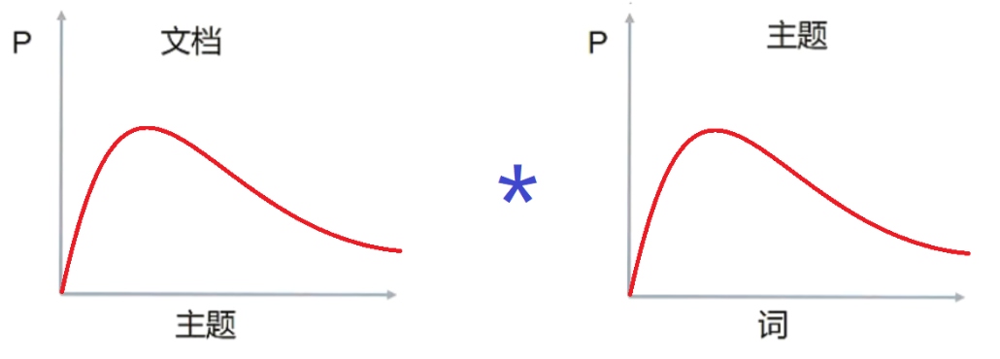

LDA生成过程：

​	1）从主题分布中抽取一个主题；2）从1中抽到的主题对于的单词分布中抽取一个单词；3）重复12至生成完整文档

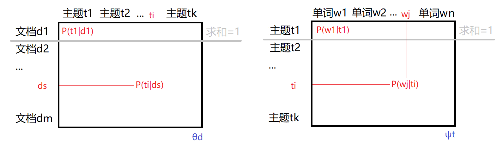

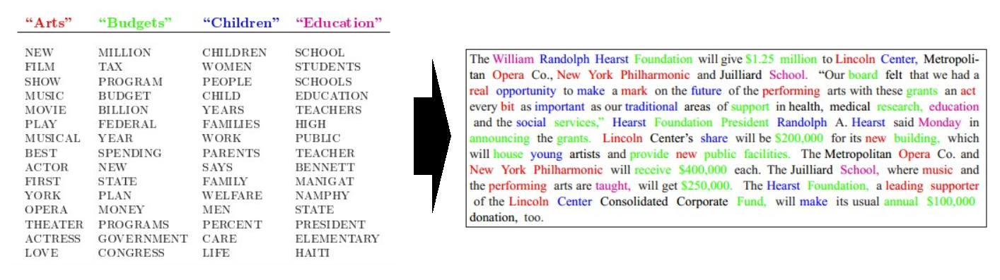

LDA 主要目标：**根据给定文档，反推其主题分布**

## 1.四个分布

·二项分布：

​	**伯努利分布**（0-1分布）：离散型随机分布、非正即负。
​	抛硬币实验为伯努利试验，**二项分布** 是N重伯努利试验下 结果为1的 总次数的概率, 记随机变量 X ~ B(n,p)
$$
P\left( k \right) =C_{n}^{k}p^k\left( 1-p \right) ^{n-k}
\\
\text{其中，}C_{n}^{k}=\frac{n!}{k!\left( n-k \right) !}
$$
·多项分布：

​	随机变量的取值 不再是0-1，而是多种离散值 {1,2,3,...,k}。
​	掷6面骰子试验，多项分布 是N重掷骰子试验下 结果为 结果分别为 1,2,3,...,k 的次数为 x1,x2,x3,...xk 的概率
​	则随机变量 X～PN(N：p1，p2，…，pn)
$$
P\left( x_1,x_2,...,x_k; n,p_1,p_2,...,p_k \right) =\frac{n!}{x_1!\cdot \cdot \cdot x_k!}p_1^{x_1}\cdot \cdot \cdot p_{k}^{x_k}
\\
\text{其中，}\sum_{i=1}^k{p_i}=\text{1,}p_i>0
$$
·Beta分布：

​	给定参数 α > 0, β > 0, 取值范围为 [0, 1] 的随机变量X的概率密度函数：f(x; α,β)， 记 X ~ Be(α,β)
$$
Gamma\text{函数：}\varGamma \left( z \right) =\int_0^{\infty}{t^{z-1}e^{-t}}d_t
\\
Beta\text{函数：}B\left( \alpha ,\beta \right) =\frac{\varGamma \left( \alpha \right) \varGamma \left( \beta \right)}{\varGamma \left( \alpha +\beta \right)}
\\
\text{则}Beta\text{分布的概率密度函数有为：}
\\
f\left( x;\alpha ,\beta \right) =\frac{x^{\alpha -1}\left( 1-x \right) ^{\beta -1}}{B\left( \alpha ,\beta \right)}
$$
·Dirichlet分布：（beta分布 在高维上的推广）

​	给定  k个参数 α1,α2,...αk, 取值范围 xi[0, 1] 的k维的随机变量 X(x1,x2,...,xk) 的概率密度函数：
$$
f\left( x_1,x_2,...,x_k;\alpha _1,\alpha _2,...,\alpha _k \right) =\frac{\prod_{i=1}^k{x_{i}^{\alpha ^i-1}}}{B\left( \alpha _1,\alpha _2,...,\alpha _k \right)}
$$
可以看到，二项分布 - 多项分布  《=》 Beta分布 - Dirichlet分布

其中，Beta分布（Dirichlet分布）是 二项分布（多项分布）的 **共轭先验概率分布** 

贝叶斯派模式：
$$
\text{先验分布}\pi \left( \theta \right) +\text{样本信息}\chi \Rightarrow \text{后验分布}\pi \left( \theta |x \right) 
\\
\text{先验}·\text{似然}=\text{后验}
\\
P\left( \theta \right) \cdot P\left( x|\theta \right) =P\left( \theta |x \right)
$$
**频率派**与**贝叶斯派** 不同的思考方式：

​	·频率派认为待估计参数 θ 是未知常数，是固定不变的，而样本X是随机的。重点研究样本；

​	·贝叶斯派认为待估计**参数 θ 是随机变量，服从一定分布**，而样本X是固定的。重点研究参数θ的分布；


定义一些变量：

​	· w 表示单词，V表示所有单词总数
​	· z 表示主题， k 表示所有主题总数
​	· D = (d1,d2,...,dm) 表示文档库，m 是文档总数
​	· d = (w1,w2,...,wn) 表示某个文档，n 是该文档的单词总数

循序渐进 的 几个主题模型：

#### 1.Unigram model 

对于文档 d = (w1,w2,...,wn),  p(wi) 表示单词 wi 的先验概率，则生成文档 d 的概率为：
$$
P\left( d \right) =\prod_{i=1}^n{p\left( w_i \right)}
$$
图模型可表示为：

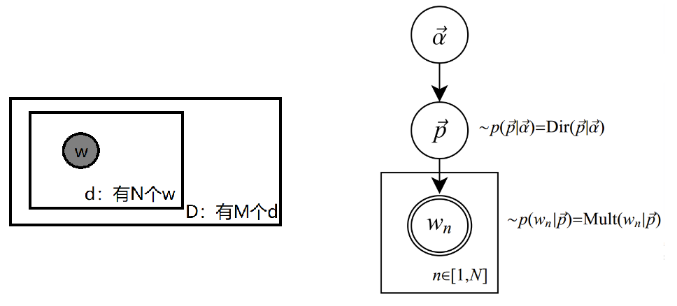

文档中的单词被假设服从 Multinomial 分布（Dirichlet的先验分布）
wn 表示在文档中 观察到的 第 n 个单词，方框表示重复，共有 N 个随机变量wn，p和α是隐藏的未知变量

#### 2.Mixture of unigrams model

​	给某个文档选定一个主题z，根据主题z生成文档。文档中所有单词都来自这个主题。
​	假设主题有 z1，z2，...，zk，生成文档 d 的概率为：
$$
p\left( w \right) =p\left( z_1 \right) \prod_{i=1}^N{p\left( w_i|z_1 \right) +}\cdot \cdot \cdot +p\left( z_k \right) \prod_{i=1}^N{p\left( w_i|z_k \right)}
\\
=\sum_z{p\left( z \right) \prod_{i=1}^N{p\left( w_i|z \right)}}
$$
其图模型如下：w为可观测变量、z未知的隐变量、N表示一篇文档中单词总数为N、M表示文档库中文档总数为M

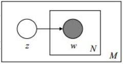

#### 3.pLSA模型  与 EM参数估计（其加上贝叶斯框架则是LDA模型）

​	在Mixture of unigrams model中，假定每篇文档 只由一个主题生成，而实际中一篇文章往往有多个主题，且这些主题在同一文章中出现的概率（占比、权重）不一样。所以 pLSA 的文档生成模式：

​	假设你有 K 个可选主题，每个主题下有 V 个可选单词； 若将写文档过程 假想为掷骰子的场景。
​		你有 1 个K面骰子 【主题骰子】每一面代表一个主题；
​		你有 K 个V面骰子【单词骰子】每个V面骰子的每一面，代表当前主题下的 一个单词；
​	若令K=3，V1,2,3 = 3，分别为：教育{大学、老师、课程}，经济{市场、企业、金融}，交通{高铁、汽车、飞机}

​	每写一个单词，先掷 主题骰子 选定一个主题，再使用主题结果对应的那颗 单词骰子 选定一个单词；重复此过程直至 确定完整篇文档的 所有单词。
​	因此，选主题 - 选单词 都是随机过程，如下图：

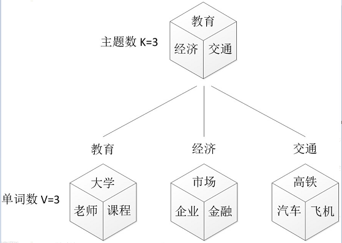

逆向思考，假设文档已经产生，如何根据已经产生好的文档反推其主题呢？【发现文档主题分布，便是主题建模的目的】
	文档d 和 单词w 是可被观察的【样本数据】，而 主题分布z 是隐藏的【求解目标】，如下图所示：

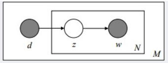

所以，pLSA 属于频率派思想，认为样本是随机的，参数是未知而固定的；
而贝叶斯派思想的 LDA 则认为样本是固定的，参数是未知而不固定的 随机变量，且服从一定分布。

根据大量已知 文档-单词 数据，训练出 【文档-主题】分布与 【主题-单词】分布，公式如下：
$$
\text{对于第}i\text{号文档，第}j\text{号单词生成概率：}P\left( w_j|d_i \right) =\sum_{k=1}^K{P\left( w_j|z_k \right) P\left( z_k|d_i \right)}
\\
\text{文档中每个单词生成概率：}P\left( d_i,w_j \right) =P\left( d_i \right) P\left( w_j|d_i \right) 
\\
=P\left( d_i \right) \cdot \sum_{k=1}^K{P\left( w_j|z_k \right) P\left( z_k|d_i \right)}
$$
​	于是，要估计的 参数θ = {P(w|z), P(z|d)}，求解思路为 max{P(待估参数θ | 给定样本)}，使θ的概率最大化。
常用的 参数估计方法有 极大似然估计 MLE、最大后验估计 MAP、贝叶斯估计等等，由于 待估参数中  含有 隐变量z，所以考虑使用 期望最大化 - EM算法。
​	 EM算法 基本思想：首先随机选取一个值初始化 待估参数θ0，然后通过不断迭代寻找更有的参数θn+1，使得其 似然函数 likelihood L(θn+1) 比 原来的 L(θn) 更大。 

### 4.LDA模型 与其参数估计

​	定义 LDA模型 中一篇文档生成的方式是：

​	1.以先验概率 Pdi 选取一篇文档 di；
​	2.从 Dirichlet 分布 α 中取样，生成文档di 的主题[多项式]分布 θi；（即θi由超参数为α的D分布生成）
​	3.从主题分布 θi中 采样，生成文档di 的第j个单词的主题 z_ij；
​	4.从 Dirichlet 分布 β 中取样，生成主题zij 的单词[多项式]分布 Φ_zij；（即Φ由超参数为β的D分布生成）
​	5.从单词分布 Φ中 采样，生成最终的 词语 w_ij

可以看出，LDA 是在pLSA的基础上，在 d主题分布，z单词分布 都加了 Dirichlet 先验。在LDA中，选取主题 和 选取单词依然是两个 随机过程，如下图：


区别在于：
	· pLSA 中，主题分布 和 单词分布 是确定不变的，而求解过程 则是 在估计这两个分布参数的过程
	· LDA 中，主题分布 和 单词分布 不再是确定不变的，它们是随机可变化的，但是它们的变化 依然服从一定的分布，即 主题分布与单次分布 由 **Dirichlet 先验** 随机确定。
	如，主题分布 P(Zi) = {0.4,0.5,0.1} or {0.2,0.2,0.6} or {0.3,0.3,0.4} ... 是由 Dirichlet先验 给定的，不是根据文档（样本）产生的。事实上，从 Dirichlet 分布中 抽取主题分布 的过程 并非完全随机的，假设取3个事件的概率模型 XYZ，可以建立如下的三维坐标系，如图所示：

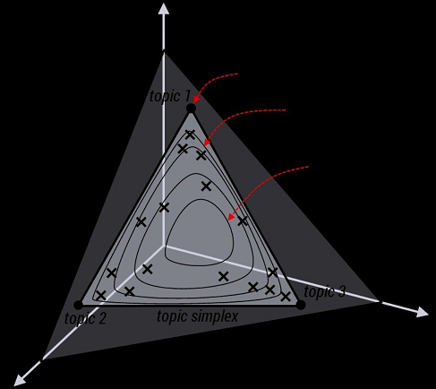

由于XYZ 三个事件的概率分布 遵循 PX+PY+PZ = 1，坐标值表示该事件在分布中的概率值，所以坐标系内的一个三角形 平面x+y+z=1 上的每一个点 Pi(xi,yi,zi) 就对应一种主题分布 {p_xi, p_yi, p_zi}。若将这个三角形平面 视做一个抽样空间，建立一个抽样概率模型，可能出现的情况如下图所示：

 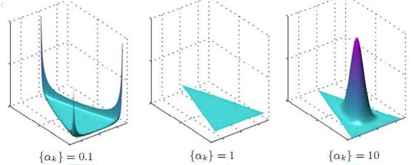

水平底面三角形是抽样空间，高度轴代表 Dirichlet 分布 抽取某个点 Pi 的概率值大小。所以，左图中 取到三角形的三个角点处的概率更大；中图中 每个点取到的概率相等；右图中，取到三角形靠中心处的点的概率更大。

那么，pLSA 与 LDA 的概率图模型如下：αβθ

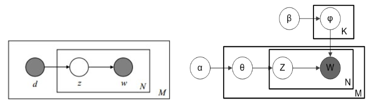

左图的 pLSA 模型中，从确定的【文档-主题】分布中抽取主题z，再从z对应的【主题-单词】分布中抽取单词w；
右图中，**LDA 根据 先验知识 α 抽取文档d的 主题分布 θ，然后这个文档d的 主题(多项式)分布 θ 中抽取一个主题z，接着根据 先验知识 β 抽取这个主题z的 单词分布 Φ，再从 这个主题z的 单词(多项式)分布 Φ 中抽取一个单词w，重复这个过程N次，就产生了这个单词总数为N的 文档d**。

其中，α ==》θ ==》z 表示生成文档中所有单词对应的 主题，α ==》θ是Dirichlet分布；θ ==》z是Multinomial多项式分布


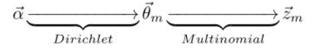

同上，β ==》Φ ==》w 表示从所有主题下生成某文档的单词, β ==》Φ是Dirichlet分布；Φ ==》w是Multinomial多项式分布

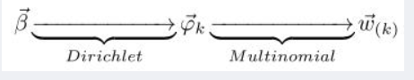

它们整体上都是一个  **Dirichlet-Multinomial 共轭** 结构。

·在pLSA 中，使用 EM算法 来估计【文档-主题】分布矩阵θ 和【主题-单词】分布矩阵Φ这两个未知而固定的参数

·在 LDA 中，可以使用**Variational inference - EM 算法**(变分推断-最大期望算法)估计，还可以用**Gibbs 采样**估计

